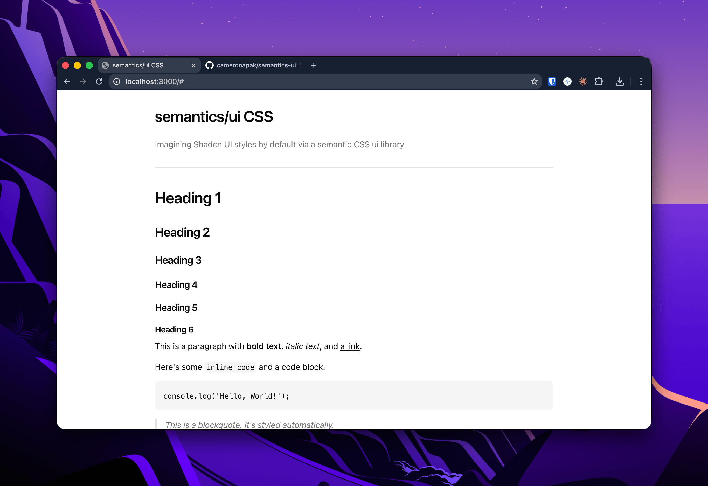

# WIP: semantics/ui

A (work-in-progress) semantic CSS component library — style native HTML elements directly, no little to no classes / attributes needed.

> [!NOTE]
> This project is a fork of [Basecoat](https://github.com/hunvreus/basecoat) by [Ronan Berder (hunvreus)](https://github.com/hunvreus), originally a vanilla CSS/JS port of [shadcn/ui](https://ui.shadcn.com). This fork reimagines Basecoat as a semantic CSS library — styling native HTML elements directly instead of using utility classes.

## Features

- **Semantic HTML** (as much as possible): Native elements like `<button>`, `<input>`, `<dialog>` are styled automatically
- **Lightweight**: Tiny CSS and JS footprint, zero framework dependencies
- **Accessible**: Semantic HTML and ARIA roles baked in
- **Dark mode ready**: Built-in dark theme support
- **Easy customization**: Override a handful of CSS variables to theme everything
- **Free and open source**: MIT licensed

## License

[MIT](/LICENSE.md)
